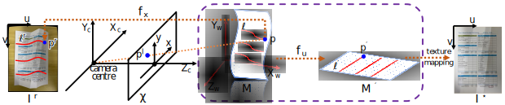
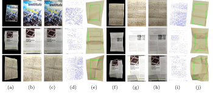
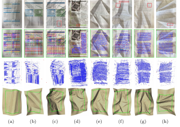
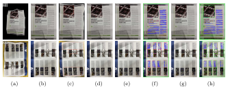
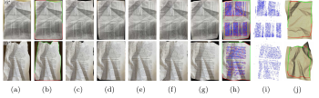

## DONG LUO \| [PENGBO BO](http://homepage.hit.edu.cn/bopengbo){:target="_blank"}

## [PDF](https://scholar.google.com/){:target="_blank"}

## Abstract

We introduce a method ...

## Citing this work

If you find this work useful in your research, please consider citing :

>@inproceedings{groueix2018,
>          title={{AtlasNet: A Papier-M\^ach\'e Approach to Learning 3D Surface Generation}},
>          author={G},
>          booktitle={Proceruedings IEEE Conf. on Computer Vision and Pattern Recognition (CVPR)},
>          year={2018}
>        }

## Method

   

Framework of document image rectification.

## Results 

The following shows the experimental results in our paper. You can click on the images below to open new links and view higher-resolution versions, or you can directly download them: [Google Drive (98 MB)](https://drive.google.com/file/d/1vkWb6GYni8nhBKZAUTtMoHRtiz3lOMNv/view?usp=share_link){:target="_blank"}.

Comparison with the multi-view method.

Comparison with the deep learning methods on Dataset I.

Comparison with the deep learning methods on Dataset II.

Comparison with the deep learning methods on Dataset III.

Point cloud quality experiments.

Feature line level experiments.

Incomplete document boundaries experiments.

